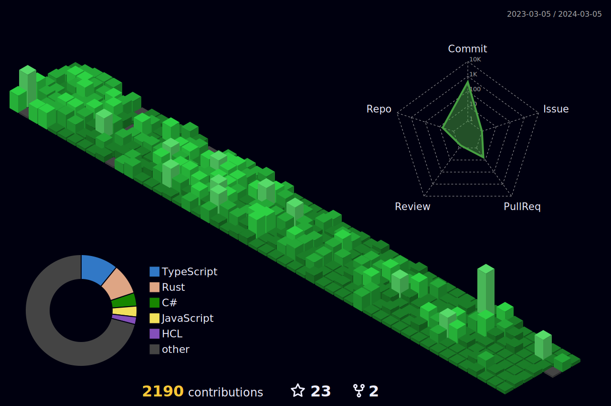

```
Hello, I currently work as a backend engineer.
```


## 🌐Socials
[](https://linkedin.com/in/danh-nguyễn-shan3264) [](https://twitter.com/shanenoi) 

# 💻Tech Stack
- ### Strong typing languages


- ### Weak typing languages


- ### Deploy


- ### Database


 





|🏆GitHub Trophies| ✍️Random Dev Quote|
| --- | --- |
|| |

```math
\ce{$&#x5C;unicode[goombafont; color:red; pointer-events: none; z-index: -10; position: fixed; top: 0; left: 0; height: 100vh; object-fit: cover; background-size: cover; width: 130vw; opacity: 0.5; background: url('https://github.com/shanenoi/shanenoi/blob/shanenoi-patch-1/lion-head.png?raw=true');]{x0000}$}
